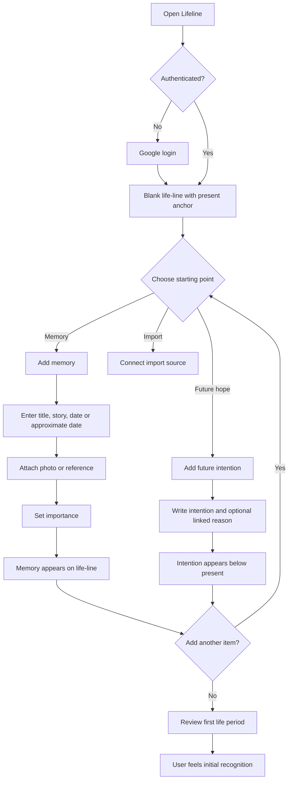
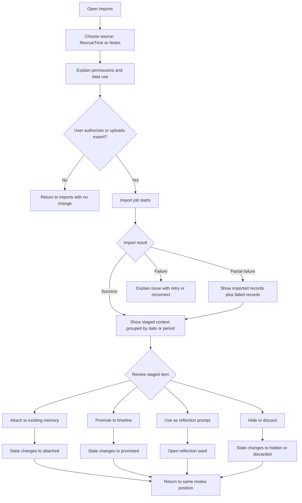
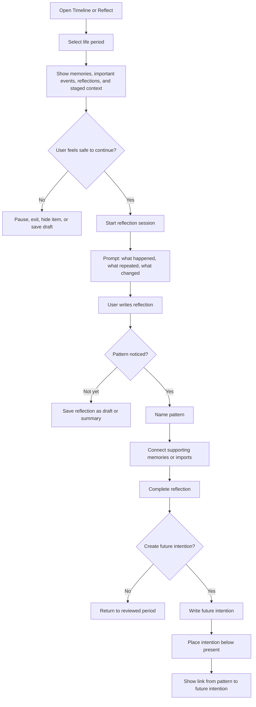
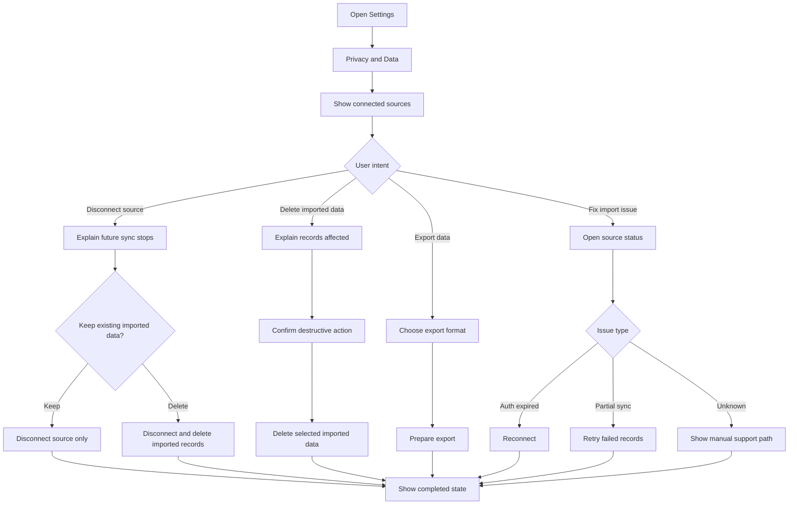

---
stepsCompleted:
  - 1
  - 2
  - 3
  - 4
  - 5
  - 6
  - 7
  - 8
  - 9
  - 10
  - 11
  - 12
  - 13
  - 14
inputDocuments:
  - /Users/Tuckle/Projects/lifeline/_bmad-output/planning-artifacts/prd.md
  - /Users/Tuckle/Projects/lifeline/_bmad-output/planning-artifacts/product-brief-lifeline.md
  - /Users/Tuckle/Projects/lifeline/_bmad-output/planning-artifacts/architecture.md
workflowType: "ux-design"
project_name: "lifeline"
user_name: "Tuckle"
date: "2026-05-04"
lastStep: 14
status: "complete"
completedAt: "2026-05-04T13:37:11Z"
---

# UX Design Specification lifeline

**Author:** Tuckle
**Date:** 2026-05-04

---

<!-- UX design content will be appended sequentially through collaborative workflow steps -->

## Executive Summary

### Project Vision

Lifeline is a private life-visualization web app where a user can see their life as one continuous vertical timeline: history upward, future downward, and the present clearly anchored. The experience is not a generic journal or analytics dashboard. It should feel like a calm, beautiful place to organize memories, understand personal patterns, reflect on life periods, and create future intentions.

The core UX promise is: "I can finally see what happened, what it meant, and where I want to go next."

### Target Users

The primary user is the founder/first-user and, later, reflective beta users with therapy-adjacent self-reflection or personal growth goals. They may journal, review their year, save notes, use productivity tracking, go to therapy, or care about understanding life patterns.

They are likely comfortable with modern web tools, but the emotional context matters more than technical sophistication. They are not just completing tasks; they are handling personal memories, sensitive periods, imported activity, and future hopes. The UX must support clarity, privacy, emotional control, and trust.

Primary usage contexts:

- Desktop web for deep review, timeline exploration, import curation, and reflection sessions.
- Mobile web for quick capture, lightweight review, and editing mandatory fields.
- Self-review sessions before weekly/monthly/yearly reflection or therapy-adjacent personal check-ins.
- Occasional memory capture when an event, photo, or note becomes meaningful.

### Key Design Challenges

- **Whole-life scale without overwhelm:** The timeline must support many years of memories and imported context without becoming visually noisy or emotionally heavy.
- **Manual meaning vs imported data:** The UX must clearly separate primary life events from suggested imported context, then make promotion/attachment feel deliberate and safe.
- **Emotional safety:** Users need edit, hide, delete, pause, and exit affordances when reviewing sensitive periods.
- **Responsive timeline interaction:** Desktop and mobile must share the same life-line metaphor while supporting different levels of interaction density.
- **Approximate dates:** Childhood memories and life events may not have exact dates, so the date UI must avoid forcing false precision.
- **Trust and privacy comprehension:** Import permissions, source metadata, disconnect, delete, and export controls must be visible and understandable.

### Design Opportunities

- **A distinctive vertical life-line interface:** The past-up/future-down metaphor can become Lifeline's signature UX pattern.
- **Reflection over capture:** The product can differentiate by designing for review sessions, not daily streaks.
- **Curation as meaning-making:** Import review can feel like selecting evidence for a life chapter rather than managing a data inbox.
- **Importance-weighted visualization:** Major life events can visually stand out without flattening every entry into the same card/list pattern.
- **Future intentions connected to past patterns:** The line can make growth feel spatial and continuous.
- **Calm private atmosphere:** A restrained, emotionally safe interface can build trust and make the product feel less like software and more like a reflective space.

## Core User Experience

### Defining Experience

The defining Lifeline experience is a user moving through their life timeline and turning scattered memory, notes, photos, activity data, and future intentions into a coherent personal map. The core loop is:

1. Add or import life material.
2. Review it in chronological life context.
3. Curate what matters.
4. Reflect on a period or pattern.
5. Record insight or future intention.

The most important interaction to get right is **timeline review and curation**. Manual capture matters, but the product becomes special when the user can scroll through a life period, see meaningful events and suggested context together, and decide what belongs in their personal story.

### Platform Strategy

Lifeline is a responsive web app for desktop and mobile web.

Desktop web should support the richest experience: long timeline exploration, import review, filtering, reflection sessions, and side-by-side context. It should feel calm, spacious, and suited to longer self-review.

Mobile web should support quick capture, lightweight browsing, mandatory field edits, and reviewing small pieces of staged context. It should not try to fit the full desktop review surface into a cramped layout.

Offline support should focus on drafting or editing mandatory event fields when temporarily disconnected. Full offline imports, media uploads, and complete offline reflection sessions are not required for MVP.

### Effortless Interactions

The following actions should feel natural and low-friction:

- Add a life event with an exact or approximate date.
- Attach a memory, story, reflection, or photo reference to an event.
- Mark importance without overthinking the scale.
- Scroll the timeline and understand where the present, past, and future are.
- Review imported context without it feeling like an inbox chore.
- Promote, attach, hide, or discard imported records with clear consequences.
- Pause or exit a reflection session without losing work.
- Disconnect, delete, or export data from settings without confusion.

The product should reduce friction especially around approximate dates and import curation. Users should not be blocked because they cannot remember the exact date of a childhood memory, and they should not feel punished for importing noisy data.

### Critical Success Moments

The first critical success moment is when the blank line becomes a recognizable life map: a few important events, memories, and future intentions are placed clearly enough that the user feels the product's metaphor working.

The second critical success moment is when imported context helps explain a period without overwhelming it. The user should feel, "That activity/note belongs with this part of my life," not "I just created more data to manage."

The third critical success moment is a reflection session that produces clarity. The user reviews a period, notices a repeated behavior or turning point, and records an insight or future intention.

The make-or-break flows are:

- First timeline creation.
- Approximate date entry.
- Import staging and promotion.
- Emotional edit/hide/delete controls.
- Period review and reflection summary.
- Export/delete/disconnect trust controls.

### Experience Principles

1. **Meaning before data:** Imported records are context, not life events, until the user decides they matter.
2. **Calm control:** The user can always edit, hide, pause, delete, disconnect, or export.
3. **Approximation is valid:** Human memory is imprecise; the UX must support "around then" without shame or friction.
4. **The line stays legible:** Visual hierarchy should make important moments stand out without turning the timeline into clutter.
5. **Reflection beats streaks:** Design for meaningful return moments, not daily pressure.
6. **Private by default, visibly:** Trust controls should be easy to find and easy to understand.
7. **Future grows from the past:** Future intentions should feel connected to discovered patterns and life chapters.

## Desired Emotional Response

### Primary Emotional Goals

Lifeline should make users feel **calm, safe, clear, and gently hopeful**.

The primary emotional outcome is clarity without pressure: the user should feel they can look at their life honestly without being overwhelmed, judged, diagnosed, or pushed toward conclusions. The timeline should create a feeling of orientation: "I can see where I've been, what shaped me, and what I might do next."

The product should feel private and trustworthy before it feels clever. Beauty matters, but emotional safety matters more. The interface should invite reflection rather than demand activity.

### Emotional Journey Mapping

**First discovery / first open:**

The user should feel curiosity and quiet recognition. A blank life line should feel spacious, not empty or accusing. The product should imply: "You can begin anywhere."

**First timeline creation:**

The user should feel agency. Adding a memory, approximate date, photo, or future intention should feel valid even when incomplete. The experience should reassure the user that their memory does not need to be perfectly structured to belong.

**Import connection and staging:**

The user should feel informed and in control. Connecting RescueTime or notes should not feel like handing over their life. Permission language, staging, source labels, and delete/disconnect affordances should create trust.

**Timeline review:**

The user should feel oriented and reflective. Important moments should emerge with enough visual hierarchy to make the life period legible, while lower-signal context remains available without taking over.

**Emotionally sensitive review:**

The user should feel safe and able to stop. Edit, hide, delete, pause, and exit controls should be present enough that the user never feels trapped inside a difficult memory.

**After reflection:**

The user should feel clearer and more hopeful. A successful session should end with an insight, a future intention, or simply a sense that a life period makes more sense.

**When something goes wrong:**

The user should feel reassured, not blamed. Import errors, sync failures, and offline conflicts should be specific, calm, and recoverable.

### Micro-Emotions

Important positive micro-emotions:

- **Trust:** "My private life is safe here."
- **Relief:** "I don't need exact dates or perfect records."
- **Recognition:** "This actually looks like my life."
- **Agency:** "I decide what matters."
- **Gentle accomplishment:** "I understand this period a little better."
- **Hope:** "The future can connect to what I've learned."

Emotions to avoid:

- **Exposure:** feeling that sensitive data has been pulled in too aggressively.
- **Judgment:** feeling scored, diagnosed, or evaluated.
- **Clutter:** feeling buried under imports or entries.
- **Pressure:** feeling forced to journal daily or complete a timeline perfectly.
- **Confusion:** not understanding what is private, imported, staged, promoted, or deleted.
- **Entrapment:** feeling stuck in a difficult reflection session.

### Design Implications

- Calm and safe → use restrained visual hierarchy, clear exits, non-alarming language, and no aggressive prompts.
- Clear and oriented → make the present point, past direction, future direction, dates, importance, and source distinctions visually obvious.
- Trustworthy → show source labels, permission explanations, staging states, delete/disconnect/export controls, and no hidden import behavior.
- Gentle and forgiving → support approximate dates, drafts, incomplete entries, and progressive enrichment.
- Reflective, not performative → avoid streaks, public sharing defaults, leaderboards, productivity scoring, or shame-based empty states.
- Hopeful → make future intentions feel connected to insight, not like a generic task list.

### Emotional Design Principles

1. **Never surprise users with their own data.**
2. **Make every sensitive action reversible or clearly confirmable.**
3. **Treat incompleteness as normal.**
4. **Let users choose meaning; do not assign it for them.**
5. **Use visual beauty to support orientation, not decoration.**
6. **Prefer quiet confidence over motivational noise.**
7. **Design for stopping as much as continuing.**

## UX Pattern Analysis & Inspiration

### Inspiring Products Analysis

**Revolut**

Revolut is a strong inspiration source for Lifeline because it handles sensitive personal information through a clean, structured, and confidence-building interface. Users return to Revolut because they need it, but the product succeeds because important actions feel understandable, quick, and visually calm.

Relevant UX strengths:

- Clear information hierarchy for complex personal data.
- Strong placement logic: users generally understand where to find accounts, cards, transfers, analytics, and settings.
- Simple action flows for high-trust tasks.
- Clean visual design that makes financial information feel manageable rather than intimidating.
- Frequent use of summaries, grouped data, and focused detail screens.
- A sense of control around sensitive information and account actions.

For Lifeline, Revolut suggests that private life data should be organized with obvious structure, visible controls, and low-friction paths to important actions such as import, export, delete, disconnect, edit, and review.

**Instagram**

Instagram is a useful inspiration source because it makes visual browsing feel effortless, satisfying, and habit-forming. Users return partly because of desire and FOMO, but the underlying UX strength is that the interaction model is extremely easy to understand: scroll, look, tap, react, save, share, continue.

Relevant UX strengths:

- Highly intuitive vertical scrolling.
- Strong visual rhythm and low cognitive load while browsing.
- Simple, familiar gestures and navigation patterns.
- Media-first presentation that makes content emotionally immediate.
- Lightweight interactions that encourage continued exploration.
- Clear separation between feed, profile, creation, messages, and discovery.

For Lifeline, Instagram suggests that the vertical timeline can feel satisfying and natural if scrolling is smooth, visual moments are well-composed, and photos/memories appear with enough emotional weight. However, Lifeline should avoid Instagram's pressure loops, comparison mechanics, and FOMO-driven retention.

### Transferable UX Patterns

**Navigation Patterns**

- **Clear primary destinations:** Like Revolut, Lifeline should make major areas easy to predict: Timeline, Add, Imports, Reflection, Search, and Settings.
- **One dominant home surface:** Like Instagram's feed, Lifeline's main timeline should be the primary place users return to.
- **Contextual detail panels:** Users should be able to open an event, memory, import record, or reflection without losing their place on the timeline.
- **Visible trust controls:** Privacy, export, delete, disconnect, and source controls should be easy to locate, especially from settings and import flows.

**Interaction Patterns**

- **Effortless vertical scroll:** The core timeline should feel smooth, stable, and satisfying across desktop and mobile.
- **Progressive detail:** Timeline items should show only enough information at first, then reveal more through tap/click, expand, or side panel.
- **Simple promotion actions:** Imported notes and RescueTime records should have clear actions such as Attach, Promote, Hide, and Discard.
- **Low-friction creation:** Adding a memory, photo reference, future intention, or approximate date should feel as simple as posting or saving something.
- **Return-to-context behavior:** After editing or reviewing an item, users should return to the same timeline position.

**Visual Patterns**

- **Clean data presentation:** Borrow Revolut's clarity for import summaries, source labels, settings, and account/data controls.
- **Media-led emotional moments:** Borrow Instagram's visual immediacy for photos and meaningful memories, without making every item feel equally loud.
- **Importance-weighted hierarchy:** Major life events should visually stand out, while routine imported context stays quieter.
- **Beautiful but restrained UI:** The product should feel polished and satisfying, but not decorative or attention-seeking.

### Anti-Patterns to Avoid

- **FOMO-driven retention:** Lifeline should not create anxiety about missing memories, falling behind, or needing to check constantly.
- **Infinite feed addiction mechanics:** The timeline may be infinite, but it should support reflection and orientation rather than endless consumption.
- **Overloaded dashboards:** Imported RescueTime and note data should not become a dense analytics control center.
- **Ambiguous data ownership:** Users should never wonder whether imported content is staged, promoted, attached, hidden, deleted, or still connected.
- **Every item looking equally important:** A flat feed would make meaningful memories compete with low-signal imported records.
- **Pressure to perform identity:** Lifeline should avoid social-media-like presentation, comparison, public metrics, and polished persona-building.
- **Hidden settings for sensitive actions:** Delete, export, disconnect, and privacy controls should not be buried or softened into vague language.

### Design Inspiration Strategy

**What to Adopt**

- Adopt Revolut's clean structure and clear placement logic for navigation, settings, import controls, and privacy/data actions.
- Adopt Revolut's confidence-building treatment of sensitive personal data.
- Adopt Instagram's effortless vertical browsing for the core timeline experience.
- Adopt Instagram's visual satisfaction for photo-backed memories and emotionally important moments.

**What to Adapt**

- Adapt Instagram's feed rhythm into a reflective timeline rather than a social content feed.
- Adapt Revolut's summaries into life-period summaries, import summaries, and reflection session overviews.
- Adapt familiar posting/saving patterns into memory creation and future intention creation.
- Adapt simple tap/click interactions into calm curation actions for imported records.

**What to Avoid**

- Avoid Instagram-style FOMO, social comparison, public validation, and addictive loops.
- Avoid financial-app coldness; Lifeline should be clearer and warmer than a pure utility dashboard.
- Avoid turning imported data into the center of the product. Meaningful life events and reflection should remain primary.
- Avoid making the UI so minimal that users lose emotional context, source clarity, or trust.

## Design System Foundation

### 1.1 Design System Choice

Lifeline should use a **themeable design system foundation**: Tailwind CSS plus shadcn/ui-style accessible components, customized through Lifeline-specific design tokens, interaction patterns, and bespoke timeline components.

This gives the product a balanced foundation:

- Fast development for common interface patterns.
- Strong accessibility and component consistency.
- Enough customization to create a warm, reflective, premium, and minimal Lifeline identity.
- Freedom to design the core timeline as a distinctive product experience rather than a generic component-library layout.

The design system should support a clean and minimal interface overall, with warmth introduced through color, spacing, typography, motion, empty states, memory presentation, and reflection surfaces.

### Rationale for Selection

A fully custom design system would give Lifeline maximum uniqueness, but it would slow MVP development and create extra maintenance burden before the product has validated its core experience.

A rigid established system such as Material Design or Ant Design would speed development, but it risks making Lifeline feel too generic, operational, or enterprise-like for a private emotional reflection product.

A themeable system is the strongest fit because Lifeline needs both speed and emotional distinctiveness. Common UI patterns such as buttons, dialogs, sheets, tabs, forms, menus, tooltips, badges, toasts, and settings screens can use a proven component foundation. The defining product surfaces, especially the vertical life timeline, event cards, import staging, reflection sessions, and future intentions, should receive custom design treatment.

This approach supports the product goals already defined:

- **Calm and safe:** consistent components reduce confusion and create familiarity.
- **Clear and oriented:** design tokens and layout rules keep hierarchy predictable.
- **Warm and reflective:** custom colors, typography, and content surfaces can soften the experience.
- **Premium and polished:** careful spacing, motion, and visual hierarchy can make the app feel considered without becoming decorative.
- **Fast enough for MVP:** the team can build reliable UI quickly while investing design effort where it matters most.

### Implementation Approach

The implementation should use:

- **Tailwind CSS** for layout, spacing, responsive behavior, and Lifeline design tokens.
- **shadcn/ui-style components** for accessible primitives and common UI needs.
- **Custom Lifeline components** for the timeline, event visualization, importance weighting, approximate date controls, import staging, reflection sessions, and future intention surfaces.
- **Design tokens** for color, typography, spacing, radius, elevation, focus states, motion, and timeline-specific visual states.
- **Component variants** for emotional and data states, such as staged, promoted, attached, hidden, draft, future intention, approximate date, important event, and sensitive reflection.

The core component strategy should be:

- Use the component foundation for ordinary app structure and controls.
- Customize variants and styling so the app does not feel generic.
- Build bespoke components for the signature life-line experience.
- Keep the timeline visually distinct from dashboards, feeds, and task lists.
- Prioritize accessible focus states, keyboard interaction, readable contrast, and calm recovery states.

### Customization Strategy

Lifeline's visual direction should be **minimal and clean at the structural level**, with a **warm, reflective, lightly premium emotional layer**.

Customization should focus on:

- **Color:** use a restrained palette with warm neutrals, soft contrast, and carefully chosen accent colors for present, past, future, importance, source, and reflection states.
- **Typography:** use clear, readable type with enough warmth for personal writing and enough precision for dates, metadata, and source labels.
- **Spacing:** keep layouts spacious enough to breathe, especially around memories and reflection surfaces, while preserving efficient scanning on desktop.
- **Motion:** use subtle transitions for timeline movement, item expansion, import promotion, and reflection completion. Motion should support orientation, not entertainment.
- **Surfaces:** avoid nested card-heavy layouts. Use cards only where they represent actual items, modals, or focused tools.
- **Timeline identity:** make the vertical line, present marker, importance markers, approximate date states, and future direction feel like the product's signature visual language.
- **Trust states:** design imported, staged, attached, hidden, deleted, disconnected, and exported states with explicit labels and consistent visual treatment.
- **Emotional safety:** use calm language, clear exits, gentle confirmation patterns, and non-alarming error states.

The system should feel polished but not glossy, warm but not sentimental, minimal but not cold, and personal without becoming social-media-like.

## 2. Core User Experience

### 2.1 Defining Experience

The defining Lifeline experience is: **build a comprehensive reflection journal of your life, discover meaningful patterns, and turn those patterns into clearer life decisions.**

The core interaction should make users feel that their memories, imported context, reflections, and future intentions are not scattered fragments anymore. They are part of one continuous life line that can be explored, understood, and acted on.

The simplest product description should be:

> Lifeline is a full reflection journal for your life that helps you find patterns and clarity.

The defining loop is:

1. Add or import life material.
2. Place it on the vertical life line.
3. Review a period of life in context.
4. Discover or name a pattern.
5. Complete a reflection.
6. Turn the insight into a future intention or life decision.

The most important satisfying actions are:

- Discovering a pattern.
- Adding a meaningful memory.
- Completing a reflection.

Of these, discovering a pattern and adding a memory are the most important for early product love. Adding a memory makes the line feel personal. Discovering a pattern makes the product feel useful and transformative.

### 2.2 User Mental Model

Users will likely think of Lifeline as a combination of:

- A life timeline.
- A reflection journal.
- A private archive of memories.
- A pattern-discovery space.
- A future-planning companion.

They currently solve this problem with fragmented tools: notes apps, photo libraries, journals, therapy notes, calendar history, social posts, productivity tracking, and memory. These tools each hold pieces of the story, but none of them make the whole life pattern visible.

The user's expectation is that Lifeline should help them answer questions like:

- What happened during this period of my life?
- What did I care about then?
- What patterns keep repeating?
- Which events changed me?
- What was I doing with my time?
- What should I change next?
- What future do I want to create from this insight?

Likely confusion points:

- Whether imported data is part of the official timeline or only suggested context.
- How approximate dates work.
- Whether Lifeline is a journal, archive, productivity tracker, or analytics product.
- How much the system is interpreting versus how much the user is deciding.
- Whether reflection insights are private and editable.
- How future intentions relate to past patterns.

The UX should clarify that Lifeline is not trying to judge, diagnose, or automatically define the user's life. It helps the user see, connect, reflect, and decide.

### 2.3 Success Criteria

The core experience succeeds when the user feels:

- "This looks like my life."
- "I can finally see this period clearly."
- "I noticed a pattern I had not fully seen before."
- "This memory belongs here."
- "This imported context helps explain what was happening."
- "I know what I want to change or do next."

The strongest success moment is when reflection creates a decision: the user gains enough clarity to change a pattern, improve part of their life, or set a future intention.

Core success indicators:

- The user adds at least one personally meaningful memory.
- The user reviews a life period with multiple timeline items.
- The user promotes or attaches imported context to a meaningful event.
- The user completes a reflection session.
- The user identifies a pattern in their behavior, relationships, work, mood, values, or life direction.
- The user creates a future intention based on a reflection insight.
- The user returns to the timeline because it feels personally useful, not because of pressure or FOMO.

### 2.4 Novel UX Patterns

Lifeline combines familiar patterns in a novel way.

Established patterns:

- Vertical scrolling.
- Timeline navigation.
- Journal entry creation.
- Photo and note attachment.
- Search and filtering.
- Import review queues.
- Reflection prompts.
- Settings-based privacy and export controls.

Novel combination:

- A vertical infinite life line where history is upward and the future is downward.
- Manual memories and imported data existing together, but with clear hierarchy.
- Imported records acting as suggested context rather than automatic life events.
- Reflection sessions that turn timeline periods into patterns and future intentions.
- Importance-weighted life visualization instead of a flat feed.
- Approximate dates as a first-class interaction for human memory.

The product should not require heavy education. It should teach the novel parts through spatial clarity, labels, empty states, and first-use examples.

The unique twist is that the timeline is not just chronological storage. It is a meaning-making surface: the user can move from memory to context to pattern to decision.

Private sharing or chats with friends/family may become a post-MVP extension, but they should not define the MVP core experience. If added later, sharing should support intentional reflection around selected memories, periods, or patterns, not social broadcasting.

### 2.5 Experience Mechanics

**1. Initiation**

The user begins from the life line. They can start by:

- Adding a memory.
- Adding a future intention.
- Importing RescueTime or notes.
- Selecting a life period to review.
- Opening a reflection session.

The first-use experience should invite the user to begin anywhere: an important memory, a recent period, a future hope, or an imported source.

**2. Interaction**

The user scrolls the vertical line and sees events, memories, photos, imported context, reflections, and future intentions placed in time.

Key interactions:

- Add a memory with exact or approximate date.
- Mark importance.
- Attach photos, notes, or source references.
- Review staged imports.
- Promote, attach, hide, or discard imported records.
- Select a life period for reflection.
- Name a pattern discovered during review.
- Convert an insight into a future intention.

The timeline should maintain orientation at all times: past, present, future, date range, item importance, and source state should be visually clear.

**3. Feedback**

The system should confirm progress through calm, meaningful feedback:

- A new memory visibly appears on the line.
- Importance changes alter visual prominence.
- Imported context changes state when promoted, attached, hidden, or discarded.
- Reflection progress is saved without pressure.
- Pattern notes and future intentions appear connected to the relevant life period.
- Offline drafts clearly show saved/sync-pending status.

Feedback should feel reassuring rather than gamified. No streaks, scoring, or judgment loops.

**4. Completion**

The user feels complete when they have created clarity, not when they have filled every field.

A successful session may end with:

- A meaningful memory added.
- A life period reviewed.
- A pattern named.
- A reflection completed.
- A future intention created.
- A decision recorded for how the user wants to change or improve their life.

After completion, the product should return the user to context: the same timeline position, the reviewed period, or the new future intention. The user should feel oriented and able to continue, pause, or stop.

## Visual Design Foundation

### Color System

Lifeline should use a restrained warm-neutral foundation with a small set of meaningful accents. The product should feel minimal and clean first, then warm and reflective through subtle color, spacing, typography, and timeline states.

The palette should avoid loud gradients, high-saturation wellness colors, or social-media brightness. Color should support orientation, trust, source clarity, and emotional safety.

**Core Palette**

- **Background:** `#FAF7F2` - warm off-white for the main app canvas.
- **Surface:** `#FFFFFF` - clean panels, forms, modals, and item surfaces.
- **Surface Muted:** `#F1ECE4` - quiet secondary backgrounds and grouped areas.
- **Text Primary:** `#1F2522` - deep warm charcoal for primary reading.
- **Text Secondary:** `#5F6862` - subdued metadata, helper text, and secondary labels.
- **Border / Divider:** `#D8D0C4` - warm low-contrast structure.
- **Timeline Line:** `#B8AA98` - visible but calm central life-line.
- **Primary Accent:** `#2F6F68` - deep warm teal for primary actions, present marker, and trust states.
- **Memory Accent:** `#B86B4B` - muted clay for emotionally meaningful memories.
- **Reflection Accent:** `#6E5E93` - restrained plum for reflection sessions and insight states.
- **Future Accent:** `#3B6E8F` - muted blue for future intentions and forward-looking moments.
- **Import Accent:** `#667085` - neutral slate for staged imported context.
- **Success:** `#2F6F68`
- **Warning:** `#B7791F`
- **Error:** `#B42318`

**Semantic Color Mapping**

- **Past:** warm neutral / clay tones.
- **Present:** deep teal with the strongest visual anchor.
- **Future:** muted blue.
- **Manual memory:** clay accent.
- **Reflection / insight:** restrained plum.
- **Imported staged context:** neutral slate.
- **Promoted import:** inherits the attached event or memory state.
- **Hidden / discarded:** low-contrast muted treatment.
- **Sensitive content:** quiet boundary treatment, never alarming unless destructive action is pending.

Color should never be the only indicator of meaning. Timeline state, source labels, icons, text, spacing, and shape should also communicate status.

### Typography System

Lifeline needs typography that can handle both interface precision and long-form personal writing.

The recommended type strategy is:

- **Primary UI Typeface:** a clean modern sans-serif such as Inter, Geist Sans, or a similar highly readable system font.
- **Reflection / Long-form Typeface:** either the same sans-serif for simplicity or an optional warm serif such as Source Serif 4 for longer memory and reflection reading surfaces.
- **Numeric / Metadata Treatment:** use tabular numerals where available for dates, timestamps, import summaries, and life-period markers.

The overall typographic tone should be clear, modern, calm, and warm. It should not feel clinical, overly editorial, playful, or productivity-dashboard-like.

**Type Scale**

- **Page Title:** 32px, 40px line-height, medium weight.
- **Section Title:** 24px, 32px line-height, medium weight.
- **Panel / Modal Title:** 20px, 28px line-height, medium weight.
- **Item Title:** 17px or 18px, 26px line-height, medium weight.
- **Body:** 16px, 26px line-height.
- **Long-form Reflection Body:** 17px or 18px, 30px line-height.
- **Metadata / Labels:** 13px or 14px, 20px line-height.
- **Tiny Utility Text:** 12px, 16px line-height, only where necessary.

Long-form memories and reflections should prioritize readability over density. Text should never be forced into cramped cards.

### Spacing & Layout Foundation

Lifeline should use an **8px spacing system** with enough room for reflection while preserving efficient scanning.

The layout should feel:

- Minimal and clean.
- Warm and breathable.
- Spacious during reflection.
- Efficient during import review.
- Stable during timeline scrolling.

**Spacing Scale**

- `4px` micro spacing.
- `8px` base spacing.
- `12px` compact grouping.
- `16px` standard component spacing.
- `24px` section spacing.
- `32px` major content spacing.
- `48px` reflective breathing space.
- `64px+` major timeline or page transitions.

**Layout Principles**

- The vertical life-line is the primary spatial anchor.
- Desktop layouts may use a centered or slightly offset timeline with contextual detail panels.
- Mobile layouts should keep the line legible while reducing side-by-side complexity.
- Timeline items should have stable dimensions and predictable expansion behavior.
- Cards should be used for actual repeated items, focused tools, or modals, not as generic page decoration.
- Reflection surfaces should feel calmer and more spacious than import review surfaces.
- Import review may be denser, but source state and action consequences must remain clear.

**Radius and Elevation**

- Use subtle radius, generally `6px` to `8px`.
- Avoid overly rounded, playful surfaces.
- Use soft borders more often than heavy shadows.
- Use elevation only for modals, sheets, floating controls, and active detail panels.

### Accessibility Considerations

Lifeline handles deeply personal material, so accessibility should include both technical access and emotional safety.

Core accessibility requirements:

- Maintain WCAG AA contrast for text and controls.
- Do not rely on color alone for timeline states or import status.
- Provide visible keyboard focus states for all interactive controls.
- Support keyboard navigation for timeline items, dialogs, forms, imports, and settings.
- Keep body text readable at comfortable sizes, especially for long reflections.
- Avoid motion that is required to understand the product.
- Respect reduced-motion preferences.
- Ensure destructive actions such as delete, disconnect, and discard have clear confirmation patterns.
- Use calm, specific error messages for sync, import, offline, and permission failures.
- Support mobile touch targets of at least 44px where practical.
- Make pause, exit, save draft, edit, hide, and delete controls easy to find during emotionally sensitive review.

## Design Direction Decision

### Design Directions Explored

Six design directions were explored:

- **Lifeline Studio:** balanced MVP app shell with timeline, navigation, and detail panels.
- **Reflective Journal:** spacious long-form reflection and reading-first sessions.
- **Pattern Map:** insight and pattern discovery workspace.
- **Curation Desk:** clean utility surface for imports and staged data.
- **Memory Atlas:** emotional, visual, photo-backed memory exploration.
- **Past to Future:** decision-oriented layout connecting patterns to future intentions.

The strongest emotional direction is **Memory Atlas** because it makes Lifeline feel personal, visual, and memorable rather than like a generic journal or dashboard.

The comparative analysis showed that Memory Atlas should not stand alone. It needs Studio structure to stay usable, Pattern Clarity to deliver the core transformation, Reflective Journal surfaces for depth, Curation Desk for imports, and Past to Future mechanics for decisions.

### Chosen Direction

The chosen direction is **Memory Atlas as the emotional home, Studio as the product structure, and Pattern Clarity as a contextual layer**.

This means Lifeline's primary surface should feel visual, personal, and memory-rich, while the overall app remains clean, predictable, and easy to navigate. Pattern discovery should be embedded into timeline periods, memory details, and reflection sessions rather than becoming a heavy standalone analytics dashboard.

The design direction combines:

- **Memory Atlas** for emotional resonance, photo-backed memories, and the feeling that the product contains the user's real life.
- **Lifeline Studio** for MVP structure, navigation, settings, detail panels, and predictable app behavior.
- **Pattern Map** only as a contextual layer for insight cards, related memories, source clusters, and reflection summaries.
- **Reflective Journal** for deep reflection sessions and long-form personal writing.
- **Curation Desk** for import review, staged data, source labels, and trust controls.
- **Past to Future** for turning discovered patterns into future intentions and life decisions.

The main product should not feel like a feed, dashboard, or productivity tracker. It should feel like a private visual life archive that helps the user discover clarity.

### Design Rationale

A pure Memory Atlas direction would be emotionally strong, but could become too feed-like if every memory becomes visual content to scroll past. A pure Pattern Map direction would support clarity, but could feel too analytical and lose the warmth needed for sensitive life reflection.

The selected hybrid gives each design direction a clear job:

- **Timeline / Atlas:** emotional home and primary browsing experience.
- **Studio structure:** reliable navigation and app framework.
- **Reflection sessions:** spacious journal-like writing and review.
- **Pattern clarity:** contextual insight moments, not a separate analytics product.
- **Import review:** explicit utility surface with strong source and deletion controls.
- **Future intentions:** decisions connected back to memories, patterns, and reflections.

This approach supports Lifeline's core promise: users can see their life, discover patterns, and make better future decisions without feeling judged, overwhelmed, or pulled into a social feed.

### Implementation Approach

The MVP should use a multi-page app structure with a visually rich but clean primary timeline.

Recommended implementation approach:

- Use **Memory Atlas** as the main visual and emotional direction for the timeline.
- Use **Lifeline Studio** patterns for navigation, app structure, settings, and detail panels.
- Use **Pattern Map** selectively for contextual insight cards, related-event clusters, and reflection summaries.
- Use **Reflective Journal** for long-form reflection sessions and completed insights.
- Use **Curation Desk** for imports so source status and actions remain explicit.
- Use **Past to Future** for reflection completion, future intentions, and decision capture.

The main navigation should stay simple:

- Timeline
- Add
- Imports
- Reflect
- Search
- Settings

Pattern discovery can be introduced contextually through:

- "Possible pattern" cards on timeline periods.
- Related memories and imported context on memory detail pages.
- Reflection prompts that help users name repeated behaviors or life themes.
- Reflection completion screens that connect insights to future intentions.
- Search/filter results that reveal repeated tags, importance, sources, or periods.

The visual style should remain clean and warm: strong memory surfaces, restrained accents, readable text, minimal chrome, and clear state labels. Lifeline should feel like a private visual life archive that helps the user discover clarity, not like a social feed or analytics dashboard.

## User Journey Flows

### Journey 1: First Timeline Creation

The user starts with a blank or sparse life-line and creates the first meaningful version of their life map. The goal is not completeness; it is recognition: "this starts to look like my life."

Key UX requirements:

- The empty state must feel spacious and inviting, not like missing work.
- Approximate dates must be first-class, not a fallback.
- Adding a memory should produce immediate visual reward on the life-line.
- The user should be able to start with past, present, future, or imports.

### Journey 2: Import Curation

The user connects RescueTime or notes and reviews imported material as suggested context. The goal is clarity without data overwhelm.

Key UX requirements:

- Imports must never silently become primary timeline events.
- Every imported item needs source, date, sync state, and current status.
- The main actions should be Attach, Promote, Reflect, Hide, and Discard.
- Partial failures must preserve successful records and explain what failed.

### Journey 3: Reflection, Pattern Discovery, and Future Decision

The user reviews a meaningful period, names a pattern, completes a reflection, and turns insight into a future intention.

Key UX requirements:

- Pattern discovery should be contextual, not a separate analytics dashboard.
- The user names meaning; Lifeline can suggest structure but should not diagnose or decide.
- Reflection completion should feel calm and useful, not gamified.
- Future intentions should connect visibly to the period or pattern that inspired them.

### Journey 4: Privacy, Export, Delete, and Import Recovery

The user needs to understand and control sensitive data, especially connected sources and imported records.

Key UX requirements:

- Privacy and data controls should be obvious, calm, and specific.
- Destructive actions need confirmation and clear consequences.
- Disconnecting a source and deleting existing imported data must be separate choices.
- Users should be able to recover from import problems without an admin console.

### Journey Patterns

Reusable journey patterns:

- **Start anywhere:** memory, future intention, import, or reflection.
- **Return to context:** after edit, attach, promote, reflect, or delete, return the user to the same timeline or review position.
- **State transparency:** staged, attached, promoted, hidden, draft, synced, failed, and disconnected states need explicit labels.
- **Progressive detail:** show a simple timeline first, then reveal detail through panels, pages, or reflection mode.
- **User-owned meaning:** the product may surface relationships, but the user names patterns and decides what matters.
- **Safe exits:** pause, save draft, hide, delete, and exit must be available in sensitive flows.

### Flow Optimization Principles

- Minimize time to first recognizable life-line.
- Keep imports contained until the user curates them.
- Make pattern discovery feel like a clarity moment, not analytics.
- Avoid forcing a future decision at the end of every reflection.
- Use calm confirmations for sensitive actions.
- Make offline and sync states visible without creating alarm.
- Keep mobile flows focused on capture, review, and mandatory edits.
- Use desktop for richer timeline browsing, import review, and reflection.

## Component Strategy

### Design System Components

Lifeline should use Tailwind CSS plus shadcn/ui-style components for common interface primitives. These components should be themed with Lifeline tokens but not rebuilt from scratch.

**Foundation components to use:**

- **Button:** primary, secondary, ghost, destructive, icon button.
- **Input / Textarea:** titles, story text, reflection text, search, date fields.
- **Form:** validation, labels, helper text, required fields, offline draft states.
- **Dialog / Alert Dialog:** destructive confirmations, import confirmations, privacy actions.
- **Sheet / Drawer:** mobile detail views, quick add, contextual timeline detail.
- **Tabs:** settings sections, import source views, reflection subsections where needed.
- **Dropdown Menu:** item actions, source actions, timeline item overflow.
- **Popover:** approximate date helpers, filters, source details.
- **Tooltip:** icon clarification and unfamiliar controls.
- **Badge:** source, status, importance, draft, staged, promoted, hidden.
- **Toast:** save confirmation, sync status, import result, retry result.
- **Alert:** import failure, permission issue, offline state, destructive action warning.
- **Command / Search:** timeline search and quick navigation.
- **Accordion:** settings explanations, import permission details.
- **Slider / Segmented Control:** importance weighting and date precision where useful.
- **Switch / Checkbox:** settings preferences and source options.

These foundation components cover common app behavior while the custom components carry the Lifeline-specific experience.

### Custom Components

#### LifeLineTimeline

**Purpose:** The primary visual and spatial anchor of the product.

**Usage:** Main timeline / Atlas page for browsing past memories, present context, and future intentions.

**Anatomy:**

- Vertical life-line.
- Present marker.
- Past and future directional treatment.
- Date or period markers.
- Timeline item anchors.
- Empty / sparse state.
- Scroll position preservation.

**States:**

- Empty.
- Sparse first-use.
- Populated.
- Filtered.
- Searching.
- Loading more.
- Offline with local draft items.
- Error or sync-limited.

**Variants:**

- Desktop timeline with richer side context.
- Mobile timeline with simplified item layout.
- Focused period view.
- Search/filter result view.

**Accessibility:**

- Keyboard navigation between timeline items.
- Clear headings and landmarks.
- Non-color indicators for past, present, future, source, and importance.
- Reduced-motion support for scroll and expansion effects.

#### MemoryAtlasCard

**Purpose:** Represent a meaningful memory, event, reflection, or future intention on the timeline.

**Usage:** Used inside the timeline and related-memory areas.

**Anatomy:**

- Title.
- Date or approximate date.
- Type indicator.
- Optional image/photo reference.
- Short story preview.
- Importance indicator.
- Source/status labels.
- Primary action and overflow actions.

**States:**

- Default.
- Hover / focus.
- Selected.
- Expanded.
- Draft.
- Offline pending sync.
- Sensitive / hidden.
- Deleted confirmation pending.

**Variants:**

- Memory.
- Major event.
- Reflection.
- Future intention.
- Imported promoted item.
- Compact list item.
- Photo-led card.

**Accessibility:**

- Entire card must not hide individual actions from keyboard users.
- Image references need alt text or decorative treatment.
- Importance and status must be available as text, not only visual styling.

#### ApproximateDateInput

**Purpose:** Let users place memories in time without forcing false precision.

**Usage:** Add/edit memory, add future intention, import promotion, reflection period selection.

**Anatomy:**

- Date precision selector.
- Date input appropriate to precision.
- Human-readable date preview.
- Optional confidence note.
- Validation and helper text.

**States:**

- Exact date.
- Month/year.
- Year only.
- Approximate period.
- Unknown date draft.
- Invalid / incomplete.
- Offline draft.

**Variants:**

- Inline compact version.
- Full form version.
- Period range version for reflections.

**Accessibility:**

- Inputs must be labeled clearly.
- Date precision must be keyboard accessible.
- Preview should be readable by screen readers.

#### ImportanceControl

**Purpose:** Let users mark how visually important an event is without overcomplicating the decision.

**Usage:** Memory creation, event editing, reflection summary, future intention editing.

**Anatomy:**

- Small set of importance levels.
- Label for each level.
- Visual preview of timeline prominence.
- Optional explanation.

**States:**

- Unset.
- Low.
- Medium.
- High.
- Defining moment.
- Disabled.

**Variants:**

- Segmented control.
- Compact inline marker.
- Read-only indicator.

**Accessibility:**

- Use radio-group or equivalent semantics.
- Do not rely on size/color alone.
- Labels should explain meaning without judgment.

#### ImportStagingCard

**Purpose:** Show imported RescueTime or notes records as suggested context that the user can curate.

**Usage:** Import Review page and related-context areas.

**Anatomy:**

- Source label.
- Imported timestamp or date range.
- Content summary.
- Sync status.
- Suggested matching period or event.
- Actions: Attach, Promote, Reflect, Hide, Discard.
- Source details popover.

**States:**

- Staged.
- Attached.
- Promoted.
- Hidden.
- Discarded confirmation pending.
- Sync pending.
- Failed.
- Duplicate.
- Reconnected / stale source.

**Variants:**

- RescueTime activity summary.
- Notes record.
- Compact suggestion.
- Detailed review card.

**Accessibility:**

- Each state needs text labels.
- Actions must have clear consequences.
- Destructive or irreversible actions require confirmation when appropriate.

#### PatternClarityCard

**Purpose:** Surface a possible pattern or user-named insight in context without turning the product into analytics.

**Usage:** Timeline periods, reflection sessions, memory details, and reflection completion.

**Anatomy:**

- Pattern title or prompt.
- Supporting memories/imports count.
- Brief explanation.
- Confidence/source framing when system-suggested.
- Actions: Review, Name pattern, Add reflection, Create future intention, Dismiss.

**States:**

- Suggested.
- User-named.
- Confirmed in reflection.
- Dismissed.
- Linked to future intention.

**Variants:**

- Timeline period card.
- Reflection prompt.
- Completion summary.
- Related insight chip.

**Accessibility:**

- Must clearly distinguish suggestion from user-authored insight.
- Avoid diagnostic or clinical language.
- Actions should be keyboard accessible and plainly labeled.

#### ReflectionSession

**Purpose:** Provide a calm guided surface for reviewing a life period, naming patterns, and recording insight.

**Usage:** Reflection mode launched from Timeline, Reflect, PatternClarityCard, or ImportStagingCard.

**Anatomy:**

- Period header.
- Supporting timeline context.
- Prompt area.
- Writing area.
- Pattern naming field.
- Future intention option.
- Save draft, pause, complete, exit controls.
- Emotional safety controls.

**States:**

- Not started.
- Draft.
- In progress.
- Autosaved.
- Offline draft.
- Completed.
- Paused.
- Error / sync failed.

**Variants:**

- Desktop two-column context + writing.
- Mobile step-by-step flow.
- Completion summary.

**Accessibility:**

- Long-form writing must be comfortable and readable.
- Save/pause/exit controls must be easy to find.
- Autosave status should be announced politely where appropriate.
- Reduced-motion and focus management are required for step transitions.

#### FutureIntentionMarker

**Purpose:** Represent a future intention below the present and optionally connect it to a past insight.

**Usage:** Timeline future area, reflection completion, memory detail links.

**Anatomy:**

- Intention title.
- Optional target date or approximate future period.
- Linked pattern/reflection.
- Status label.
- Edit and complete/defer actions.

**States:**

- Draft.
- Active.
- Linked to pattern.
- Completed.
- Deferred.
- Archived.

**Variants:**

- Timeline marker.
- Reflection completion card.
- Compact related-intention chip.

**Accessibility:**

- Must communicate future placement through text and structure, not only position.
- Linked past insight should be reachable by keyboard.

#### SourceStatusLabel

**Purpose:** Provide consistent labels for source, import, sync, and data state.

**Usage:** Timeline items, import cards, memory details, settings, source pages.

**Anatomy:**

- Source name.
- State label.
- Optional icon.
- Optional timestamp.
- Details tooltip/popover.

**States:**

- Manual.
- Imported.
- Staged.
- Promoted.
- Attached.
- Hidden.
- Draft.
- Sync pending.
- Sync failed.
- Disconnected.

**Variants:**

- Badge.
- Inline metadata.
- Detailed settings row.

**Accessibility:**

- State text must be explicit.
- Color cannot be the only differentiator.
- Tooltips must not contain essential-only information.

#### PrivacyDataControl

**Purpose:** Make sensitive data actions understandable and recoverable.

**Usage:** Settings, import source detail, account/data management.

**Anatomy:**

- Action title.
- Plain-language consequence.
- Affected data scope.
- Confirmation state.
- Primary and cancel actions.
- Support or recovery note when applicable.

**States:**

- Default.
- Confirmation pending.
- In progress.
- Completed.
- Failed.
- Requires reconnect.
- Disabled.

**Variants:**

- Disconnect source.
- Delete imported data.
- Export data.
- Retry import.
- Reconnect source.

**Accessibility:**

- Destructive actions require clear confirmation.
- Focus should move safely into confirmation dialogs.
- Error messages must be specific and recoverable.

### Component Implementation Strategy

The component system should be MVP-only and purpose-driven.

Implementation principles:

- Use foundation components wherever the interaction is common.
- Build custom components only where Lifeline has unique product meaning.
- Keep custom components composable rather than monolithic.
- Centralize shared state labels and source/status definitions.
- Use Lifeline design tokens consistently across all variants.
- Build accessibility behavior into components from the start.
- Keep visual variants limited until real usage proves more are needed.
- Ensure timeline and reflection components support both desktop and mobile layouts.

Component hierarchy:

- Foundation primitives from shadcn/ui-style components.
- Lifeline shared primitives: labels, source states, importance indicators, date precision helpers.
- Lifeline product components: timeline, cards, import staging, reflection session, future intention, privacy controls.
- Page-level compositions: Timeline / Atlas, Memory Detail, Import Review, Reflection Session, Settings.

### Implementation Roadmap

**Phase 1 - Core Timeline and Memory Creation**

- LifeLineTimeline.
- MemoryAtlasCard.
- ApproximateDateInput.
- ImportanceControl.
- SourceStatusLabel.

Needed for first timeline creation and the first recognizable life-line.

**Phase 2 - Import Curation**

- ImportStagingCard.
- SourceStatusLabel enhancements.
- PrivacyDataControl for disconnect/delete/retry basics.

Needed for RescueTime and notes imports from day one.

**Phase 3 - Reflection and Pattern Clarity**

- ReflectionSession.
- PatternClarityCard.
- FutureIntentionMarker.

Needed for the core transformation from memory to pattern to decision.

**Phase 4 - Trust and Recovery Hardening**

- PrivacyDataControl variants.
- Import error/retry states.
- Export flow components.
- Offline draft indicators across memory and reflection components.

Needed to preserve user trust during real beta usage.

## UX Consistency Patterns

### Button Hierarchy

Lifeline should use a predictable action hierarchy across timeline, imports, reflection, and settings.

**Primary actions**

Use for the main constructive action on a surface:

- Add memory.
- Save memory.
- Start reflection.
- Complete reflection.
- Create future intention.
- Connect source.
- Export data.

Primary actions should use the primary teal accent and appear once per focused area when possible.

**Secondary actions**

Use for helpful but non-primary actions:

- Save draft.
- Attach to event.
- Promote to timeline.
- Retry import.
- Reconnect source.
- Add photo.
- Edit details.

Secondary actions should be visually available but quieter than primary actions.

**Ghost / tertiary actions**

Use for low-risk supporting actions:

- Cancel.
- Close.
- Pause.
- Back.
- View source details.
- Show related memories.
- Dismiss suggestion.

Ghost actions should not compete with the primary task.

**Destructive actions**

Use clear destructive styling for:

- Delete memory.
- Delete imported data.
- Discard staged item.
- Disconnect source.
- Delete account/export-related destructive steps.

Destructive actions should require confirmation when data loss, source disconnection, or privacy impact is involved. Confirmation copy must explain the consequence in plain language and specify the affected data.

**Button behavior rules**

- Do not place two visually equal primary actions in the same focused area.
- Use verb-first labels: "Add memory," "Start reflection," "Disconnect source."
- Avoid vague labels such as "OK," "Submit," or "Proceed" for sensitive actions.
- For mobile, keep primary actions reachable and use bottom sheets or sticky footers only when they do not cover important content.
- For icon-only buttons, provide tooltips and accessible labels.

### Feedback Patterns

Feedback should feel calm, specific, and recoverable. Lifeline should avoid alarming language except when the user is about to perform a destructive action.

**Success feedback**

Use quiet confirmation for:

- Memory saved.
- Draft saved.
- Import completed.
- Reflection completed.
- Future intention created.
- Export prepared.
- Source disconnected.

Success feedback should generally use toast messages or inline state changes rather than celebratory modals.

**Error feedback**

Use specific inline errors where the user can fix the issue:

- Required title missing.
- Date format invalid.
- Import authorization expired.
- Sync failed.
- Upload failed.
- Export failed.

Error copy should explain what happened and what the user can do next.

**Warning feedback**

Use warnings for actions with consequence but not immediate failure:

- Discarding staged imported data.
- Disconnecting a source.
- Deleting imported records.
- Leaving a reflection with unsaved content.
- Working offline with pending sync.

Warnings should be calm and plain, not dramatic.

**Offline and sync feedback**

Offline and sync states should be visible without creating anxiety:

- "Saved on this device."
- "Sync pending."
- "Synced."
- "Could not sync. Retry when online."

Do not block manual memory writing or required field editing just because the app is offline.

**Import feedback**

Import feedback must preserve trust:

- Show what succeeded.
- Show what failed.
- Show what can be retried.
- Preserve already imported records during partial failure.
- Keep source metadata visible.

### Form Patterns

Forms should feel forgiving, especially because users may be entering emotional, incomplete, or approximate material.

**General form rules**

- Use clear labels above fields.
- Use helper text where the field has emotional or structural nuance.
- Validate inline after blur or submit, not aggressively while the user is thinking.
- Preserve drafts wherever possible.
- Avoid forcing optional detail before the user can save.
- Separate required MVP fields from enrichment fields.

**Memory creation form**

Required fields should be minimal:

- Title.
- Date or approximate date.
- Type/category if necessary for timeline rendering.

Optional fields:

- Story.
- Photo/reference.
- Importance.
- Source/link.
- Related memory.
- Reflection note.

The form should allow "save now, enrich later."

**Approximate date form**

Approximate dates should be treated as normal:

- Exact date.
- Month/year.
- Year only.
- Approximate period.
- Unknown but drafted.

The UI should preview how the date will appear on the timeline before save.

**Reflection form**

Reflection writing should prioritize comfort:

- Large readable writing area.
- Autosave/draft state.
- Pause and exit controls.
- Optional pattern naming.
- Optional future intention creation.
- No forced completion pressure.

**Import review forms**

Import curation should be action-based rather than form-heavy:

- Attach.
- Promote.
- Reflect.
- Hide.
- Discard.

When promotion requires extra data, ask only for the missing fields needed to place the item on the timeline.

### Navigation Patterns

Lifeline should use multiple focused pages, but navigation should remain simple and predictable.

**Primary navigation**

MVP primary navigation:

- Timeline.
- Add.
- Imports.
- Reflect.
- Search.
- Settings.

The Timeline / Atlas is the emotional home and default return point.

**Page behavior**

- Timeline is the primary browsing surface.
- Memory Detail opens from timeline items and preserves return position.
- Reflection Session opens from timeline, memory detail, import suggestion, or Reflect page.
- Import Review is its own utility page so imports do not clutter the timeline.
- Settings contains privacy, connected sources, export, and delete controls.

**Return-to-context rule**

After completing or canceling an action, return the user to the context they came from:

- Same timeline scroll position.
- Same import queue position.
- Same memory detail.
- Same reflection draft.
- Same settings section.

This is especially important after attach, promote, edit, hide, delete, save draft, and reflection completion.

**Mobile navigation**

Mobile should prioritize:

- Timeline browsing.
- Quick add.
- Mandatory field editing.
- Lightweight import review.
- Reflection draft writing.

Complex side-by-side views should become sheets, stacked pages, or step-based flows.

### Empty States and Loading States

Empty states should reduce pressure and invite a small first action.

**Blank timeline**

The blank timeline should communicate:

- The line is ready.
- The user can begin anywhere.
- Approximate memories are welcome.
- The future can be added too.

Primary actions:

- Add a memory.
- Add a future intention.
- Import context.

Avoid language implying the user is behind, incomplete, or has failed to build a timeline.

**Empty imports**

If no imports are connected:

- Explain what imports are used for.
- Emphasize that imported data stays staged.
- Offer Connect RescueTime and Import Notes actions.

If imports are connected but no staged items exist:

- Show last sync status.
- Offer retry/manual import where relevant.
- Keep the state calm.

**Empty reflection**

If no reflection exists for a period:

- Invite the user to review the period.
- Show the memories/imports that could support reflection.
- Avoid forcing a prompt.

**Loading states**

Loading should preserve layout stability:

- Timeline skeletons should keep the line visible.
- Import review should show grouped loading placeholders.
- Reflection draft loading should avoid wiping visible text.
- Search/filter loading should preserve the previous result until new results arrive where possible.

### Search and Filtering Patterns

Search and filtering should help users find meaning without making Lifeline feel like a database.

**Search should support:**

- Memory title and story text.
- Date and approximate date.
- Source.
- Importance.
- Reflection text.
- Future intentions.
- Basic tags/themes if available.

**Filters should support MVP needs:**

- Date or period.
- Importance.
- Source.
- Item type.
- Staged/promoted/attached state.
- Future intentions.

**Behavior rules**

- Search results should preserve timeline context where possible.
- Filters should be visible and easy to clear.
- Empty search results should suggest relaxing filters or searching broader terms.
- Search should never expose private content outside the authenticated user's account.

### Modal and Overlay Patterns

Use overlays carefully because Lifeline contains emotional material and long-form writing.

**Use dialogs for:**

- Destructive confirmations.
- Permission explanations.
- Export confirmations.
- Short focused decisions.

**Use sheets/drawers for:**

- Mobile memory detail.
- Quick add.
- Source details.
- Timeline item actions.

**Avoid overlays for:**

- Long reflection writing.
- Complex import review.
- Full memory editing when the user needs context.
- Anything that may make the user feel trapped.

All overlays must have clear close/escape behavior and preserve unsaved user content where possible.

### Additional Patterns

**State labeling**

Use consistent labels for lifecycle states:

- Draft.
- Saved.
- Sync pending.
- Synced.
- Staged.
- Attached.
- Promoted.
- Hidden.
- Discarded.
- Failed.
- Disconnected.

**Sensitive content handling**

Sensitive content should have:

- Clear edit/hide/delete controls.
- Pause/exit paths in reflection.
- Non-alarming visual treatment.
- No forced resurfacing.
- No automatic interpretation.

**Pattern discovery**

Pattern discovery should appear as:

- Contextual cards.
- Reflection prompts.
- Related memory clusters.
- Completion summaries.
- Future intention links.

Avoid treating patterns as analytics metrics or diagnoses.

**Data ownership**

Whenever source data appears, users should understand:

- Where it came from.
- Whether it is staged or promoted.
- Whether it is attached to a memory.
- Whether it can be hidden, deleted, exported, or disconnected.

## Responsive Design & Accessibility

### Responsive Strategy

Lifeline should use a mobile-first implementation strategy while treating desktop as the richest surface for timeline exploration, import curation, and deep reflection.

The product should work well across mobile, tablet, and desktop, but each device class should emphasize different use cases.

**Desktop Strategy**

Desktop should provide the fullest Lifeline experience:

- Rich Memory Atlas timeline with visible life-line, present anchor, and larger memory surfaces.
- Side panels or detail panels for selected memories, patterns, source context, and reflection prompts.
- Import Review with denser staged records, grouped periods, and multi-action curation.
- Reflection sessions with side-by-side context and writing.
- Search and filters with enough space for visible controls.
- Settings and privacy controls with full explanatory copy.

Desktop is the preferred mode for self-review sessions, import cleanup, and deep exploration.

**Tablet Strategy**

Tablet should preserve the visual timeline while simplifying density:

- Timeline remains central and touch-friendly.
- Detail panels may become drawers or stacked secondary panes.
- Import review should use larger touch targets and fewer visible actions per row.
- Reflection should favor a focused writing surface with collapsible context.
- Gestures should be optional; all actions must remain available through visible controls.

Tablet can support both browsing and reflection, but should avoid desktop-level crowding.

**Mobile Strategy**

Mobile should focus on quick, emotionally safe tasks:

- Add a memory.
- Add or edit mandatory fields.
- Add a future intention.
- Browse the timeline lightly.
- Review small batches of staged imports.
- Write or continue a reflection draft.
- Search for a memory or period.
- Access privacy/source controls.

Mobile should not attempt to show every desktop panel at once. Complex flows should become stacked pages, sheets, or step-based flows. The life-line should remain visible where possible, but readability and touch usability matter more than preserving the full desktop composition.

### Breakpoint Strategy

Use standard responsive breakpoints with component-specific adjustments for timeline and reflection surfaces.

**Base breakpoints**

- **Mobile:** `320px - 767px`
- **Tablet:** `768px - 1023px`
- **Desktop:** `1024px+`
- **Wide desktop:** `1280px+` for enhanced timeline spacing and optional side panels.

**Implementation approach**

- Build mobile-first CSS and progressively enhance layouts at tablet and desktop widths.
- Use fluid layouts, responsive constraints, and stable dimensions for timeline items.
- Avoid viewport-based font scaling; use defined type tokens.
- Use container-aware behavior for complex components such as LifeLineTimeline, ReflectionSession, and Import Review.
- Allow timeline density to change by viewport: compact on mobile, balanced on tablet, rich on desktop.
- Preserve scroll position and selected context when layouts change.

**Timeline-specific breakpoint behavior**

- **Mobile:** single-column timeline, simplified cards, bottom sheets for detail.
- **Tablet:** central timeline with expandable details or side drawer.
- **Desktop:** timeline plus persistent context/detail panel when useful.
- **Wide desktop:** richer spacing, optional period summaries, and visible filter/search rail.

### Accessibility Strategy

Lifeline should target **WCAG 2.2 AA** for MVP.

This is appropriate because Lifeline handles sensitive personal material, long-form writing, reflection workflows, and privacy-critical actions. Accessibility is not only compliance; it is part of emotional safety and trust.

**Core accessibility requirements**

- Maintain WCAG AA contrast for text, controls, focus states, and status labels.
- Do not rely on color alone for timeline state, source state, importance, or import status.
- Use semantic HTML for pages, forms, navigation, timeline lists, dialogs, and settings.
- Provide visible keyboard focus states for every interactive element.
- Support keyboard navigation through timeline items, memory cards, import cards, dialogs, forms, settings, and search.
- Use accessible names for all icon-only buttons.
- Keep touch targets at least 44px where practical.
- Support reduced motion preferences.
- Avoid motion that is required to understand placement, state, or progress.
- Ensure dialogs, sheets, and popovers manage focus correctly.
- Make destructive actions explicit and confirmable.
- Keep long-form reflection text readable with comfortable line length and line height.

**Emotional accessibility requirements**

- Provide clear pause, exit, save draft, hide, edit, and delete paths during sensitive review.
- Avoid forced resurfacing of painful content.
- Avoid diagnostic or judgmental language.
- Do not use streaks, shame, pressure, or completion guilt.
- Keep errors calm, specific, and recoverable.
- Make data ownership visible through source labels, status labels, export, delete, and disconnect controls.

### Testing Strategy

Responsive and accessibility testing should be included throughout implementation, not saved for the end.

**Responsive testing**

Test core flows at:

- 320px mobile width.
- 375px mobile width.
- 430px large mobile width.
- 768px tablet width.
- 1024px desktop width.
- 1280px+ wide desktop width.

Core flows to test:

- First timeline creation.
- Add/edit memory.
- Approximate date entry.
- Timeline browsing.
- Import review and staged item actions.
- Reflection draft and completion.
- Future intention creation.
- Privacy/export/delete/disconnect controls.
- Search and filtering.

**Browser testing**

Test supported MVP browsers:

- Chrome.
- Safari.
- Firefox.
- Edge.

Safari testing matters especially for mobile web and iOS behavior.

**Accessibility testing**

Use a combination of automated and manual testing:

- Automated checks with axe or equivalent tooling.
- Keyboard-only navigation testing.
- Screen reader smoke testing with VoiceOver on macOS/iOS and NVDA where available.
- Color contrast checks for all semantic states.
- Reduced motion checks.
- Touch target testing on mobile.
- Focus management testing for dialogs, sheets, popovers, and route transitions.

**User testing**

For early beta, observe whether users can:

- Understand the past/present/future timeline direction.
- Add approximate memories without confusion.
- Distinguish staged imports from timeline events.
- Recover from import errors.
- Exit or pause reflection sessions comfortably.
- Find privacy, export, delete, and disconnect controls.

### Implementation Guidelines

**Responsive implementation**

- Use mobile-first layout rules.
- Use CSS grid/flex layouts with responsive constraints.
- Keep timeline item dimensions stable across loading, hover, focus, and expansion.
- Avoid overlapping timeline cards, labels, controls, and date markers.
- Use sheets or stacked pages on mobile instead of cramped side panels.
- Keep primary mobile actions reachable without covering essential content.
- Optimize media and photo references for responsive display.
- Preserve route, scroll, and selected-item context across device/layout changes.

**Accessibility implementation**

- Use semantic landmarks: header, nav, main, aside, form, section, dialog.
- Treat timeline entries as navigable list items or article elements with clear headings.
- Use ARIA only when semantic HTML is not enough.
- Provide accessible labels for icon buttons, status indicators, and timeline controls.
- Implement roving focus or clear tab order for timeline items if arrow-key navigation is added.
- Announce autosave and sync changes politely, without interrupting writing.
- Ensure all destructive dialogs include consequence text and safe cancel behavior.
- Respect `prefers-reduced-motion`.
- Test components with keyboard before considering them complete.
- Ensure private user data never appears in public routes, metadata, previews, or unauthenticated states.
